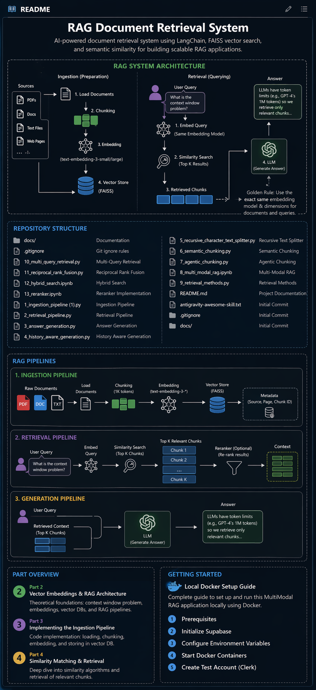

---

# 🚀 RAG Document Retrieval System

AI-powered document retrieval system using **LangChain, FAISS, and advanced retrieval techniques** to build scalable, production-ready **Retrieval-Augmented Generation (RAG)** pipelines.

---

## 🧠 Overview

This project implements a **full RAG pipeline** from scratch, covering:

* Document ingestion & preprocessing
* Advanced chunking strategies
* Semantic search & hybrid retrieval
* Multi-query + rank fusion techniques
* Answer generation using LLMs

Built to **solve the context window problem** by retrieving only the most relevant data instead of feeding entire documents to an LLM.

---

## 🏗️ RAG Architecture

### 🔹 1. Ingestion Pipeline (Preparation)

* Load raw documents (PDF, TXT, etc.)
* Apply chunking strategies:

  * Recursive chunking
  * Semantic chunking
  * Agentic chunking
* Convert text into embeddings
* Store embeddings in vector DB (FAISS)

---

### 🔹 2. Retrieval Pipeline (Querying)

* Convert user query → embedding
* Perform retrieval using:

  * Vector similarity search
  * Multi-query retrieval
  * Hybrid search (keyword + semantic)
* Apply:

  * Reciprocal Rank Fusion (RRF)
  * Reranking (improves relevance)
* Return top-K relevant chunks

---

### 🔹 3. Generation Pipeline

* Combine:

  * User query
  * Retrieved context
* Pass to LLM
* Generate final answer

Optional:

* History-aware responses
* Agent-based decision making

---

## 📂 Repository Structure

```
📁 docs/                          # Documentation

📄 1_ingestion_pipeline.py        # Document ingestion
📄 2_retrieval_pipeline.py        # Retrieval logic
📄 3_answer_generation.py         # LLM response generation
📄 4_history_aware_generation.py  # Conversational RAG

📄 5_recursive_character_text_splitter.py  # Basic chunking
📄 6_semantic_chunking.py                 # Meaning-based chunking
📄 7_agentic_chunking.py                  # AI-driven chunking

📄 8_multi_modal_rag.ipynb        # Multi-modal RAG
📄 9_retrieval_methods.py         # Different retrieval strategies

📄 10_multi_query_retrieval.py    # Query expansion
📄 11_reciprocal_rank_fusion.py  # Rank fusion algorithm
📄 12_hybrid_search.ipynb        # Hybrid retrieval
📄 13_reranker.ipynb             # Result reranking

📄 README.md
```

---

## ⚙️ Key Concepts Implemented

### 🔸 Context Window Problem

LLMs have token limits → cannot process huge documents directly.

👉 Solution: Retrieve only **relevant chunks**

---

### 🔸 Embeddings

Text → high-dimensional vectors capturing semantic meaning

* Same embedding model must be used for:

  * Documents
  * Queries

---

### 🔸 Vector Database

Stores embeddings for fast similarity search

* FAISS (used in this project)

---

### 🔸 Advanced Retrieval Techniques

* **Multi-Query Retrieval** → Better recall
* **Hybrid Search** → Combines keyword + semantic
* **Reciprocal Rank Fusion (RRF)** → Combines multiple rankings
* **Reranking** → Improves final relevance

---

## 🔥 Features

✅ End-to-end RAG pipeline
✅ Multiple chunking strategies
✅ Advanced retrieval (RRF, Hybrid, Multi-query)
✅ Modular & extensible codebase
✅ Notebook + script support
✅ Multi-modal RAG support

---

## 🐳 Local Setup (Docker)

### Prerequisites

* Docker
* Python 3.10+

### Steps

1. Initialize backend services (e.g., Supabase if used)
2. Configure environment variables
3. Start Docker containers
4. Run ingestion pipeline
5. Start retrieval + generation

---

## 🧪 How It Works (Flow)

```
User Query
   ↓
Query Embedding
   ↓
Retriever (Vector + Hybrid + RRF)
   ↓
Top-K Relevant Chunks
   ↓
LLM
   ↓
Final Answer
```

---

## 📌 Future Improvements

* Real-time streaming responses
* Better reranking models (cross-encoders)
* UI interface (chat-based system)
* Deployment on cloud (AWS/GCP)
* Integration with AI learning systems

---

## 👨‍💻 Author

Gautam Naik

---

## ⭐ Why This Project Matters

This project goes beyond a basic RAG demo by implementing **production-level retrieval techniques** used in:

* Enterprise search systems
* AI copilots
* Knowledge assistants

---
